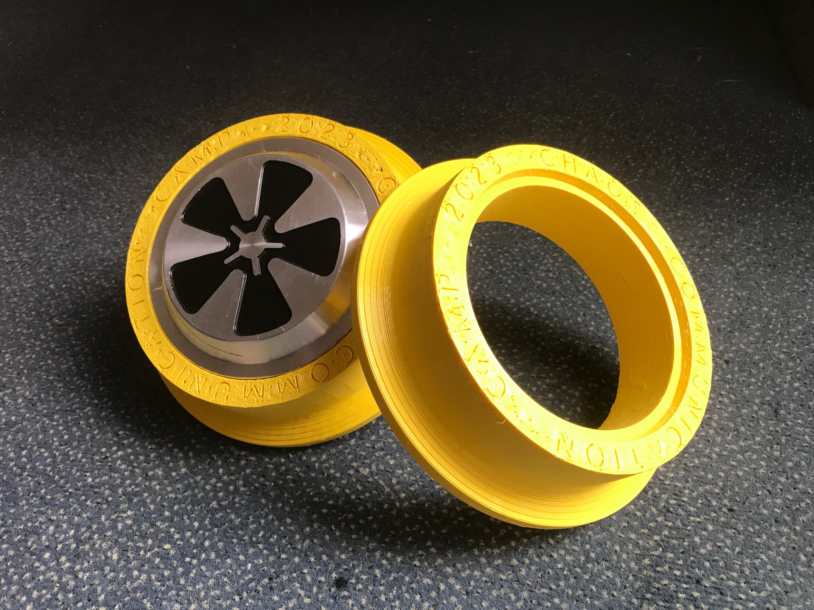

# Small Gauge Train Wheel Tires for Hoverboard Motors

This repository contains FreeCAD and STL files to print your own set of wheel tires. Just in time for a certain [summer event](https://events.ccc.de/category/camp-2023/) at the Ziegeleipark Mildenberg!

## Version history

**v7**: First public release.
The design has not yet been tested on real rails.

## Filament

Use **TPU** filament with a hardness of **95A** or better.

Successful prints were made with *Fillamentum Flexfill TPU98A* and *Esun TPU 95A* as a more cost-effective option.

**WARNING**: TPU sticks extremely well on PEI build plates and may strip the coating. Use a textured build plate and high Z distance for the first layer.

## Recommended Print Settings

* Volcano hotend with a 0.8mm Bondtech CHT nozzle
* 240°C, 100% cooling, no bed heating
* 0.5mm layer height, 70mm/s print speed = 28.00 mm³/s
  * Use same speed for everything -- walls, infill, etc.
* At least 2.4mm wall thickness, 3 top/bottom layers
* 33% "lines" infill, concentric top/bottom pattern
* Tune pressure advance at the desired speed and temperature
  * TPU needs a high value like 0.1

This will result in 100m of filament / 300g per tire while achieving a fast print time below 3 hours. 100mm/s is also possible, but I had problems with warping (bending and lifting up the entire build plate).

## FreeCAD Settings

I used RealThunder's FreeCAD LinkStage3 branch v2023.05.21, but other recent versions should also work.

### STL Export Quality

By default, FreeCAD will export very low resolution STL files with visible polygon artifacts.

You can improve this by lowering the maximum mesh deviation:

* Edit → Preferences → Mesh Formats tab
  * Maximum mesh deviation: 10µm

**NOTE**: In typical FreeCAD quirkiness, you have to import an STL file first to see the "Mesh Formats" tab.

See: <https://forum.freecad.org/viewtopic.php?p=202630&sid=7fc59b195f00a3d57d245c826f2d6784#p202630>

### Display Quality

The default tessellation settings are also too low to work with curved lines. Both the Part Design and Sketcher workbenches have their own settings to tweak:

* Edit → Preferences → Part/Part Design → Shape view tab
  * Maximum deviation: 0.1%
  * Deviation lower bound: 0.1%

* Edit → Preferences → Sketcher → Display tab
  * Segments per geometry: 500

## Updating the text

The embossed text can be updated in just 14 easy steps:

### Inkscape

* Edit Text in `drawing.svg`
* Save as `drawing_path.svg`
* Path → Object to Path
* Delete helper circles
* Save

### Draft Workbench

* File → Import `drawing_path.svg`
* Delete Frame
* Select all Text
* Modification → Draft to Sketch
* Remove Path objects and second sketch
* Move Sketch to Body

### Part Design Workbench

* Select front face of Tire
* Map Sketch to Face
* Finally: Pocket

## License

This work is licensed under a [Creative Commons Attribution-ShareAlike 4.0 International][cc-by-sa] License.

[![CC BY SA 4.0][cc-by-sa-image]][cc-by-sa]

[cc-by-sa]: http://creativecommons.org/licenses/by-sa/4.0/
[cc-by-sa-image]: https://i.creativecommons.org/l/by-sa/4.0/88x31.png
